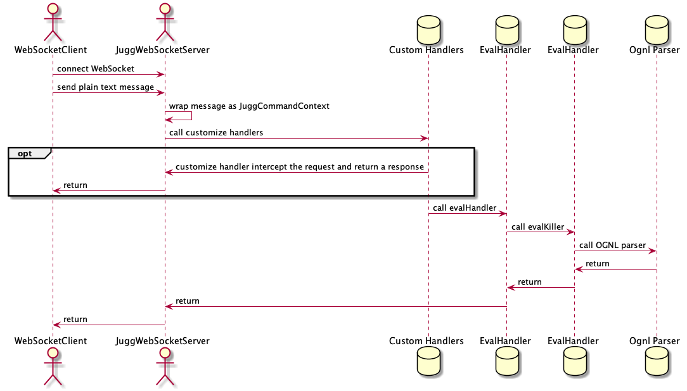

# Jugg
  


`jugg` is a C/S Structure `OGNL` parser, or can think of it as a `Java REPL`.

Feed easy to use `jugg` to debug your Java's program as enjoyable as `Python REPL`.

## Dependency

```
<dependency>
    <groupId>com.xhinliang</groupId>
    <artifactId>jugg</artifactId>
    <version>2.0.0</version>
    <exclusions>
        <exclusion>
            <groupId>org.slf4j</groupId>
            <artifactId>slf4j-jdk14</artifactId>
        </exclusion>
    </exclusions>
</dependency>
```

## Core Concept

We introduce `Jugg`'s core concept by a simple `Spring Boot` project.

### Core Flow


### IBeanLoader

`IBeanLoader` is a interface, We use it to define how to load a `Class` or a objact (We will call it `Bean` in the future).


With `IBeanLoader`, we have the freedom to control the logic of the `Class` loading and `Bean` loading of the `OGNL` parser for a better operational experience.

We provide an flexible implementation of `IBeanLoader` as `FlexibleBeanLoader`.


``` java
public static void main(String[] args) {
    ConfigurableApplicationContext configurableApplicationContext = new SpringApplication(MainApp.class).run(args);

    // jugg threads.
    IBeanLoader beanLoader = new FlexibleBeanLoader() {

        @Override
        protected Object getActualBean(String name) {
            return configurableApplicationContext.getBean(name);
        }

        @Override
        public Object getBeanByClass(@Nonnull Class<?> clazz) {
            return configurableApplicationContext.getBean(clazz);
        }
    };

    JuggEvalKiller evalKiller = new JuggEvalKiller(beanLoader);

    List<IJuggInterceptor> handlers = Lists.newArrayList(//
            new JuggLoginHandler((username, password) -> password.equals(USER_PASSWORD.get(username))), //
            new JuggAliasHandler(beanLoader), //
            new JuggCheckHandler(commandContext -> true), //
            new JuggEvalHandler(evalKiller) //
    );

    JuggWebSocketServer webSocketServer = new JuggWebSocketServer(JUGG_PORT, handlers, MainApp::getResourceAsFile);
    webSocketServer.startOnNewThread();
}
```

### JuggCommandContext

`JuggCommandContext` is an abstraction of a request, containing information about the user, requesting content, and so on.

### IJuggEvalKiller

`IJuggEvalKiller` decides how to execute a `JuggCommandContext`.

``` java
public interface IJuggEvalKiller {

    /**
     * Eval a command and get the value.
     * @param commandContext command & context from client.
     * @return eval result.
     */
    Object eval(CommandContext commandContext);
}
```

### JuggWebSocketServer

`JuggWebSocketServer` is a `WebSocket` Server for `WebSocket` client's request.

``` java
JuggWebSocketServer webSocketServer = new JuggWebSocketServer(JUGG_PORT, handlers);
webSocketServer.startOnNewThread();
```

### OGNL

The OGNL syntax is generally similar to the normal Java syntax, but there still are some differences, so please refer to the official documentation.

[OGNL official documentation](https://commons.apache.org/proper/commons-ognl/language-guide.html)

### More OGNL

`Jugg` extends `OGNL` with `IBeanLoader`, which makes it easier to use.

#### Bean's autoload

With `IBeanLoader`, `Jugg` can automatically load the `Bean`.
For example, you can combine `Spring` with `Jugg`.
``` java
ConfigurableApplicationContext configurableApplicationContext = new SpringApplication(MainApp.class).run(args);

IBeanLoader beanLoader = new IBeanLoader() {

    @Nullable
    @Override
    public Object getBeanByName(String name) {
        try {
            return configurableApplicationContext.getBean(name);
        } catch (NoSuchBeanDefinitionException catchE) {
            return null;
        }
    }
    @Nullable
    @Override
    public Object getBeanByClass(@Nonnull Class<?> clazz) {
        try {
            return configurableApplicationContext.getBean(clazz);
        } catch (NoSuchBeanDefinitionException e) {
            return null;
        }
    }
    // more
};
```

``` bash
# userService is a Spring bean
# u can use it directly, because jugg will call Spring to ininitialize it.
> userService.getById(123L)
{
   "id": 123,
   "name": test
}
```

#### Use SimpleClassName to call a static method

`OGNL` needs FQCN(Fullly Qualified Class Name) to call a static method by default, but you can use SimpleClassName in `Jugg`.
``` java
//  load all the Class of ClassLoader, as map(simpleClassName -> fullyQualifiedClassName)
Map<String, String> clazzMap = new HashMap<>();
Configuration configuration = new ConfigurationBuilder() //
        .setUrls(Stream.of(ClasspathHelper.forPackage("com"), ClasspathHelper.forPackage("org"), ClasspathHelper.forPackage("net")) //
                .flatMap(Collection::stream) //
                .collect(Collectors.toSet())) //
        .setScanners(new SubTypesScanner(false));

Reflections reflections = new Reflections(configuration);
reflections.getAllTypes().forEach(s -> {
    String simpleClassName = s.substring(s.lastIndexOf(".") + 1);
    clazzMap.putIfAbsent(simpleClassName, s);
});

IBeanLoader beanLoader = new IBeanLoader() {

    @Nonnull
    @Override
    public Class<?> getClassByName(String name) throws ClassNotFoundException {
        try {
            return Class.forName(name);
        } catch (ClassNotFoundException classNotFound) {
            String retryClassName = clazzMap.getOrDefault(name, name);
            return Class.forName(retryClassName);
        }
    }
    // more
};
```

``` bash
> @Maps@newHashMap()
{ }
```

#### Alias

You can customize the name of your `Class` or `Bean` by `alias` command.

``` bash
> alias target M Maps
done

> @M@newHashMap()
{ }
```

### Clients

`jugg` use plain text `WebSocket` protocol as REPL, 
So any `WebSocket` client can be used directly  in theory, even of `wsdump.py`.

We have two offical client now
- `web` a web client implement by `React`.
- `node-client` a cli client implement by `Node.js`.

### License

```
MIT License

Copyright (c) 2019 XhinLiang

Permission is hereby granted, free of charge, to any person obtaining a copy
of this software and associated documentation files (the "Software"), to deal
in the Software without restriction, including without limitation the rights
to use, copy, modify, merge, publish, distribute, sublicense, and/or sell
copies of the Software, and to permit persons to whom the Software is
furnished to do so, subject to the following conditions:

The above copyright notice and this permission notice shall be included in all
copies or substantial portions of the Software.

THE SOFTWARE IS PROVIDED "AS IS", WITHOUT WARRANTY OF ANY KIND, EXPRESS OR
IMPLIED, INCLUDING BUT NOT LIMITED TO THE WARRANTIES OF MERCHANTABILITY,
FITNESS FOR A PARTICULAR PURPOSE AND NONINFRINGEMENT. IN NO EVENT SHALL THE
AUTHORS OR COPYRIGHT HOLDERS BE LIABLE FOR ANY CLAIM, DAMAGES OR OTHER
LIABILITY, WHETHER IN AN ACTION OF CONTRACT, TORT OR OTHERWISE, ARISING FROM,
OUT OF OR IN CONNECTION WITH THE SOFTWARE OR THE USE OR OTHER DEALINGS IN THE
SOFTWARE.

```
